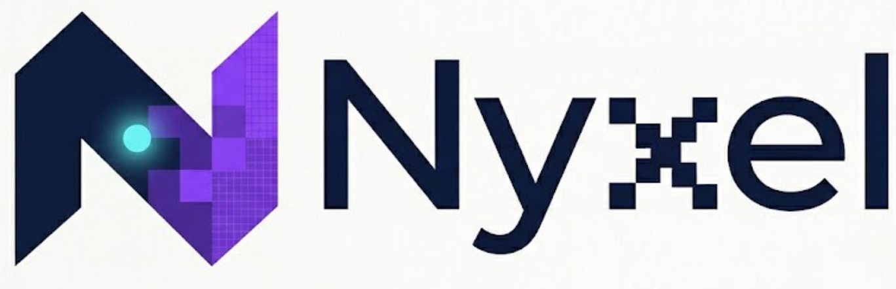

<p align="center">
  <a href="https://github.com/nyxellang/nyxel/wiki">
    
  </a>
</p>

<div align="center">

<a href="https://github.com/nyxellang/nyxel/blob/main/LICENSE">
  
</a>

<a href="https://www.python.org/">
  
</a>

<a href="https://github.com/nyxellang/nyxel/stargazers">
  
</a>

<a href="https://github.com/nyxellang/nyxel/wiki">
  
</a>

<a href="https://github.com/nyxellang/nyxel/commits/main">
  
</a>

</div>

# Nyxel

Nyxel is a simple, high-level programming language designed to be easy to read, and understand.
You just need to understand English or Arabic and you'd be set.

The philosophy of nyxel is that programming should be easy for everyone not just people who want to continue in tech
Programming shouldn't take days of studying it needs to be simple and easy.

## Requirements


Python 3.10 or higher, thats it.


## Run a script

If one linux or MacOS:

```bash
sudo chmod +x nyx

./nyx run filename.nx
```

On windows:
```
python nyx run filename.nx
```

## How to use

I highly suggest you to read the )

You will learn a lot about Nyxel and how to use it

## Features 

 - Simple
 - Easy to read
 - Easy to debug
 - Bilingual
 - Correction if someone has an error
 
## Try the REPL

```
python nyx repl
```
or
```
./nyx repl
```

## Example
```nyxel
let users = get("https://jsonplaceholder.typicode.com/users")

let active = users where item.name.length <= 10

for each user in active:

say(user.name)
```

## Bilingual example

```nyxel
اجعل name = "Ahmed"

عندما name.length > 4:
  
قل("long name")
```

## example script


Open `projects/perfect.nx` — it shows a big part of what the language can do.


## Issues

The main one is that because its on Python it is quite slow but until now the speed doesn't matter that much because its still simple enough that the most demanding script won't take much time

## License

This project is under the MIT lincense
